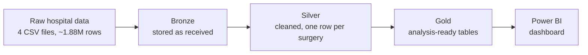

# Surgical Scheduling Variance Analysis

**How accurately does a hospital estimate how long each surgery will take, what do the misses cost, and which procedures should be fixed first?**

### [▶ Open the live dashboard](https://thrinesh13.github.io/Surgical-Scheduling-Variance-Analysis/)
*Runs in the browser. No sign-in or Power BI licence needed.*

---

## Project Overview

| | |
|---|---|
| **Domain** | Healthcare operations: hospital operating room (OR) scheduling |
| **Business problem** | Surgery time estimates are rarely checked. Wrong estimates cause overtime, delays and idle rooms |
| **Who it is for** | OR leadership, scheduling committees, hospital finance and capacity planning |
| **Data** | 48,118 real surgical cases (de-identified) across 418 procedure types, 5.75 years, UC Irvine Medical Center |
| **Tools** | Microsoft Fabric, PySpark, Spark SQL, Power BI, DAX |
| **Output** | Interactive dashboard and a ranked list of procedures to review first |

## Key Findings

| **46.7%** | **7,539 hrs** | **$15.8M to $27.1M** | **133** |
|:---:|:---:|:---:|:---:|
| of surgeries finished within 30 min of their typical time | of yearly time variation across all cases | yearly cost exposure from that variation | procedures that drive 53.6% of the variation |

- **More than half of surgeries (53.3%) ran over 30 minutes longer or shorter** than that procedure normally takes.
- **Early finishes are a hidden cost.** They waste about **2,167 room hours a year**, roughly one fully staffed OR sitting idle every working day. Standard reports only track late cases.
- **A short review list does most of the work.** 133 of 418 procedures (about a third) account for more than half of all lost time.
- **The standard "30 minute" rule misjudges long surgeries.** For example, heart bypass surgery (CABG) looks unreliable under that rule but is one of the most predictable procedures once its length is considered.

---

## Business Problem

Every surgery is booked with an estimate of how long it will take. That estimate decides which room is used, when it starts, which staff are held, and how many cases fit after it.

- If a case **runs long**, the hospital pays overtime and every case behind it is delayed.
- If a case **finishes early**, a fully staffed room sits empty.

On a single case, a miss of 30 minutes to an hour doesn't look like much. The room gets used, the schedule adjusts, and the day moves on. Across thousands of surgeries a year, those misses add up to **7,539 hours of room time**, worth an estimated **$15.8M to $27.1M**.

Hospitals rarely go back and check whether their estimates were accurate, so this cost stays hidden in day-to-day operations.

This project does that check. It compares 48,118 surgeries against the typical duration for each procedure, measures how far and how often cases miss, puts a cost on the gap, and ranks the procedures that should be reviewed first.

## Business Questions

1. How often do surgeries run longer or shorter than normal for that procedure?
2. Do the misses lean late, early, or both?
3. What is that variation worth in hours and dollars each year?
4. Which procedures should the scheduling committee review first?

## Stakeholders

| Stakeholder | Decisions Supported |
|---|---|
| OR and surgical leadership | Which procedures go on the review agenda, and in what order |
| Scheduling and block-time committees | How much time to book per procedure |
| Finance and capacity planning | Whether a "we need more rooms" problem is really a booking-accuracy problem |

---

## Recommendations

1. **Start with the 133 high-impact procedures.** They cover over half the lost time.
2. **Set booking times per procedure on purpose.** Adding padding to everything reduces overruns but increases idle time.
3. **Clean up procedure names first.** 207 procedure names cover more than one type of operation, which makes them look less predictable than they are. This is the cheapest fix.
4. **Add a percentage-based tolerance** next to the 30 minute rule so long, well-estimated surgeries are not flagged unfairly.
5. **Start recording the booked duration.** This is the one data change that would separate a bad estimate from normal surgical variation.

> [!NOTE]
> The dollar figures are a **scenario, not a confirmed loss**. They use illustrative rates of $35 to $60 per OR minute, and some variation is simply the nature of surgery. Treat the range as an upper bound on what better scheduling could recover.

---

## Solution Architecture

| Step | What happened | Notebook |
|---|---|---|
| **1. Load** | Loaded four raw files into a Microsoft Fabric lakehouse and verified row counts matched the source | [`01_bronze_ingest`](notebooks/01_bronze_ingest.ipynb) |
| **2. Clean** | Removed 1,366 duplicate rows, fixed 13 broken timestamps, and flagged every value that was changed | [`02_silver_patient_information`](notebooks/02_silver_patient_information.ipynb) |
| **3. Model** | Built a benchmark for each procedure (its typical duration from at least 30 past cases) and compared every surgery against it | [`03_gold`](notebooks/03_gold.ipynb) |
| **4. Report** | Built a Power BI data model with 17 DAX measures and an interactive dashboard | [`powerbi/`](powerbi/) |

The full process runs automatically as a Fabric pipeline in about 7 minutes and gives the same result every run.

<b>Methodology and Data Quality</b>

 

**Benchmark choice.** Each procedure's benchmark is its historical **median** duration, not the average. Surgery times are skewed by a few very long cases, and an average would make ordinary cases look early.

**Minimum volume.** A procedure needs 30 qualifying cases to get a benchmark. This was tested: the lowest-volume quartile misses the 30 minute band 61.5% of the time versus 55.2% for the highest, so a higher floor would lose coverage for little gain.

**Typical miss vs. average miss.** The average miss is 54.1 minutes, but the typical (median) miss is 33.0 minutes. A small number of very large misses pulls the average up.

**Overruns vs. early finishes.** Late cases are slightly more common (1.26 to 1) and much larger when they happen (107.8 min vs. 65.9 min on average). This holds for 388 of 418 procedures.

**Percentages.** Cohort percentages are calculated across all 48,118 cases, not averaged from per-procedure rates, so large procedures carry their true weight (53.28% vs. 58.4% unweighted).

**Data cleaning checkpoints**

| Checkpoint | Rows |
|---|---:|
| Raw patient records | 65,728 |
| After removing exact duplicates | 64,362 |
| One row per surgery | 64,354 |
| Final cleaned table | 64,353 |
| With a usable OR duration | 57,861 |
| **Cases in scope** | **48,118** |

Cleaning barely changed the headline averages (54.0 to 54.1 min), but it did change the totals, which the cost figures rely on.

**Pipeline and model screenshots**

---

## Limitations

- **No booked times in the source data.** The benchmark is each procedure's historical median, so a poor estimate and naturally variable surgery look the same.
- **Cost rates are assumptions**, not any hospital's actual costs.
- **Rare procedures are excluded.** 16.8% of cases with a usable duration fall outside the analysis, mostly due to low volume.
- **Dates are shifted for privacy**, so seasonal and weekday patterns cannot be studied.
- **Duration means time in the room**, from entry to exit, not surgery time alone.

## Data Source

[MOVER](https://doi.org/10.24432/C5VS5G), a de-identified surgical dataset released by UC Irvine Medical Center. Access requires a data use agreement, so **no patient-level data is stored in this repository**.

## Repository Structure

| Folder / file | Contents |
|---|---|
| [`dashboard/`](dashboard/) | Static web version of the dashboard |
| [`notebooks/`](notebooks/) | PySpark notebooks for each pipeline step |
| [`powerbi/`](powerbi/) | Power BI project (data model and report) |
| [`docs/DATA_QUALITY.md`](docs/DATA_QUALITY.md) | Data profiling, cleaning and validation rules |
| [`docs/DATA_LINEAGE.md`](docs/DATA_LINEAGE.md) | How each field flows from source to dashboard |
| [`docs/DASHBOARD_GUIDE.md`](docs/DASHBOARD_GUIDE.md) | How to read and filter the dashboard |

> The web dashboard is a fixed snapshot built so it can be shared without a Power BI licence. It does not refresh from Fabric.
